# **Math Kit**

[Math Kit](https://github.com/sarahhudaib/Math-Kit) is a GUI desktop app, that is made specifically for performing basic and advanced mathematical operations  (as will be mentioned below)  without any additional hassle as it insures that it serves the main purpose of providing a top-tier mathematical help with not much spent effort by the user.


<br>


## **Math Kit features**:

The provided features by the Math Kit are:

- **Home Page:** This window or page is used display brief information about the project and a simple guide on how to use it and navigate through the different workspaces.

- **Workspace Page:** This window is where all the mathematical operations will be carried out, and it contains cards for each one of the following operations:
      
    - ***Calculator:*** This workspace has a calculator that performs a few simple and a bit more advanced operations, such as: 
    ```
        1. Addition 
        2. Subtraction
        3. Multiplication
        4. Division
        5. Square root of a number
        6. Log of a number
        7. The trigonometric functions, including:
            - sin
            - cos
            - tan
            - sec
            - csc
            - cot
        8. The hyperbolic trigonometric functions, including:
            - sinh
            - cosh
            - tanh
            - sech
            - csch
            - coth
    ```
    <br>

    - ***Plotter:*** This workspace allows the user to plot the graph of either:
        ```
        1. An entered polynomial equation.
        2. Or a data set from a csv file.
        ```    
        using the [**matplotlib**](https://matplotlib.org/) library, and the [**NumPy**](https://www.dataquest.io/blog/numpy-tutorial-python/) in Python.
    
    <br>

    - ***Convertor:*** This workspace allows the user to convert a chosen unit into another unit of measurement from the same category or quantity set, which are:
        ```
        1. Temperature
        2. Length
        ```

    <br>


    - ***Randomizer:*** This workspace gives the user two options:
        ```
        1. Generating a random list, while giving the upper, lower and length of the list.
        2. Creating a random list made up of any data type they choose.
        ```
    <br>

    - ***Statistics:*** This widnow performs mathematical operations relating to a given set or data, such as:
    ```
        1. Mean
        2. Median
        3. Mode
        4. Standard Deviation
        5. Min
        6. Max
    ```   
    - ***Calculus:*** This window performs more complex mathematical operations, such as:
    ```
    1. Derivation
    2. Integration
    3. Evaluation
    ```
For further explanation, please refer to the [**workspace cards**](work_space_cards.md) file, and the section ***Minimum Viable Product*** in the [**requirment**](requirment.md) file.
    
<br>

- **Team Info:** This window is for showing more information about the developers and authors behind this project.
<br>

- **Settings:** This window is for controlling a few characteristics of the GUI, such as:
    ```
    - Theme: Dark or light.
    ```

<br>

## **Planning of the Project**

**The Project Planning on Replit:** 
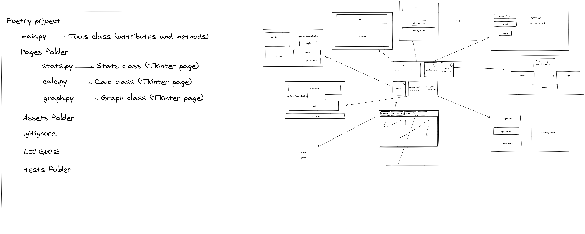


<br>

**The Project Planning on Trello:**
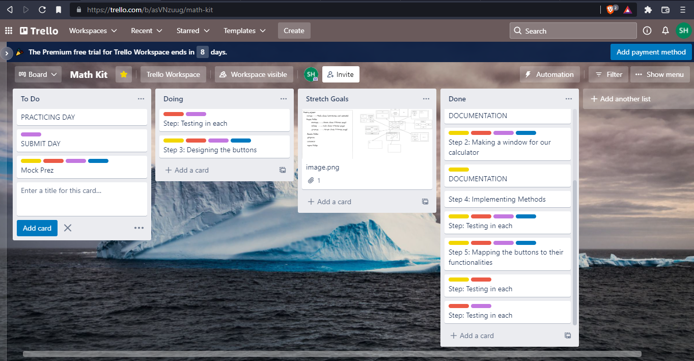

<br>


<br>


## **Project Directory Tree**
```
├── .github
│   ├── ISSUE_TEMPLATE
│   |    ├── bug_report.md
│   │    └── feature_request.md
├── math_kit
│   ├── assets
|   |    |── avatars
│   |    |  ├── batool.png
│   |    |  ├── mustafa.png
│   |    |  ├── salim.png
│   |    |  └── sara.png
│   |    |── csv
│   |    |  ├── data.csv
│   |    |  ├── gold.csv
│   |    |  ├── left_result.csv
│   |    |  ├── right_result.csv
│   |    |  └── Salary_Data.csv
│   |    |── icons
│   |    |  ├── calc.png
│   |    |  ├── clear.png
│   |    |  ├── convert.png
│   |    |  ├── diff.png
│   |    |  ├── flip.png
│   |    |  ├── info.png
│   |    |  ├── numeric.png
│   |    |  ├── plot.png
│   |    |  ├── random.png
│   |    |  ├── splash.png
│   |    |  └── stats.png
│   |    |── issues
│   |    |  └── issue.png
│   |    |── planning
│   |    |  ├── planning-of-mathkit-replit.png
│   |    |  └── planning-of-mathkit-trello.png
│   |    |── plots
│   |    |  └── plot.png
│   |    |── sounds
│   |    |  ├── card_click.wav
│   |    |  └── navigate_click.wav
│   |    |── wire_frames
│   |    |  ├── calculator_version1.PNG
│   |    |  ├── convertor_version1.PNG
│   |    |  ├── home_version1.PNG
│   |    |  ├── home_version2.PNG
│   |    |  ├── plotter_version1.PNG
│   |    |  ├── randomizer_version1.PNG
│   |    |  ├── settings_version2.PNG
│   |    |  ├── teaminfo_version1.PNG
│   |    |  ├── teaminfo_version2.PNG
│   |    |  ├── workspace_version1.PNG
│   |    |  └── workspace_version2.PNG
│   ├── pages_content
│   │    ├── derive_and_integrate.py
│   │    ├── home.py
│   │    ├── main_page.py
│   │    ├── numerical_operations.py
│   │    ├── plotting.py
│   │    ├── random_generator.py
│   │    ├── scienfitic_calculator.py
│   │    ├── settings.py
│   │    ├── stats.py
│   │    ├── team_info.py
│   │    ├── unit_converter.py
|   |    └── workspace.py
|   ├── __init__.py
|   ├── main.py
|   ├── tempCodeRunnerFile.py
├── tests
│   ├── test_GUI
│   |    ├── test_ask_open_file.py
│   |    ├── test_grid.py
│   |    ├── test_horizontal_scale.py
│   |    ├── test_label_button.py
│   |    ├── test_question_icon.py
│   |    └── test_top_level_widget.py
│   ├── test_image
│   |    └── blue.png
|   ├── __init__.py
|   ├── test_random_generator.py
|   ├── test_scientific_calc.py
|   ├── test_statistics.py
├── .gitignore
├── bug_issue_image.md
├── CODE_OF_CONDUCT.md
├── config.yml
├── CONTRIBUTING.md
├── LICENSE
├── poetry.lock
├── pyproject.toml
├── README.md
├── requirements.md
└── work_space_cards.md
```

<br>

## **Used Libraries and Tools**

### **Libraries or Modules**:
    - Tkinter
    - Tkinter.ttk
    - Custom Tkinter
    - Pillow 
    - Pytest
    - Poetry
    - NumPy
    - matplotlib
    - webbrowser 
    - threading
    - playsound
    - black in Poetry

### **Tools**
    - VS Code 
    - Zoom
    - Github
    - Slack
    - Discord
    - Powerpoint
    - Replit
    - Trello


<br>


## **Change Log**

The project has gone through a couple of iterations while deploying its GUI, and the change log is as follows:

<br>

### **Version 1.0.0:**

In this version, the project was in its initial state, using [**tkinter**](https://docs.python.org/3/library/tkinter.html) as the main GUI framework.

The frameworks for each window in Version 1.0.0, are as follows:

**The Home Window:**


**The Workspace Window:**
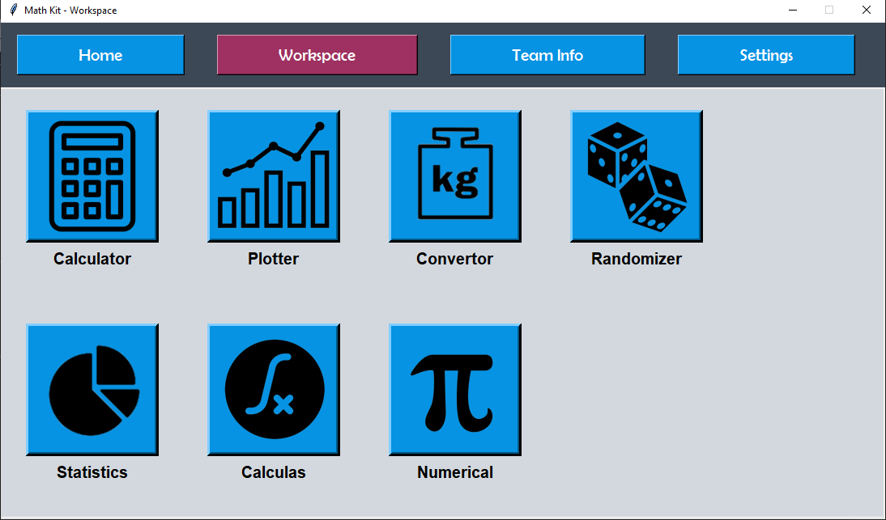

**The Calculator Window:**
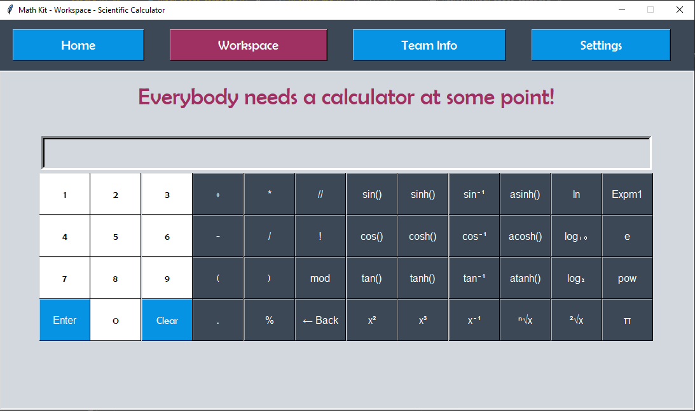

**The Plotter Window:**


**The Convertor Window:**


**The Randomizer Window:**
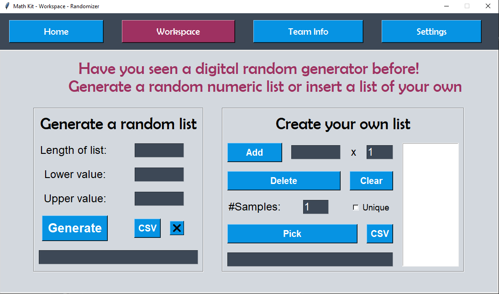

**The Team Info Window:**


<br>


### **Version 1.0.1:**

In this version, we used [**custom tkinter**](https://github.com/TomSchimansky/CustomTkinter) on top of [**tkinter**](https://docs.python.org/3/library/tkinter.html) to create the GUI, as we found that this would create a much aesthetically pleasing GUI experience for the user.

Important changes were made to the GUI, such as the addition the option of selecting a theme in the **Settings** window, either:
```
1. Dark mode
2. Light mode
```

And this new implementation of the theme was tested on a Windows 10 OS system, and it was found to be aesthetically pleasing, especially if the system was set to dark mode when the user chooses the dark mode theme in the settings window, and if it was set to light mode when the user chooses the light mode theme in the settings window.


The frameworks for each window in Version 1.0.1, are as follows:

**The Home Window:**
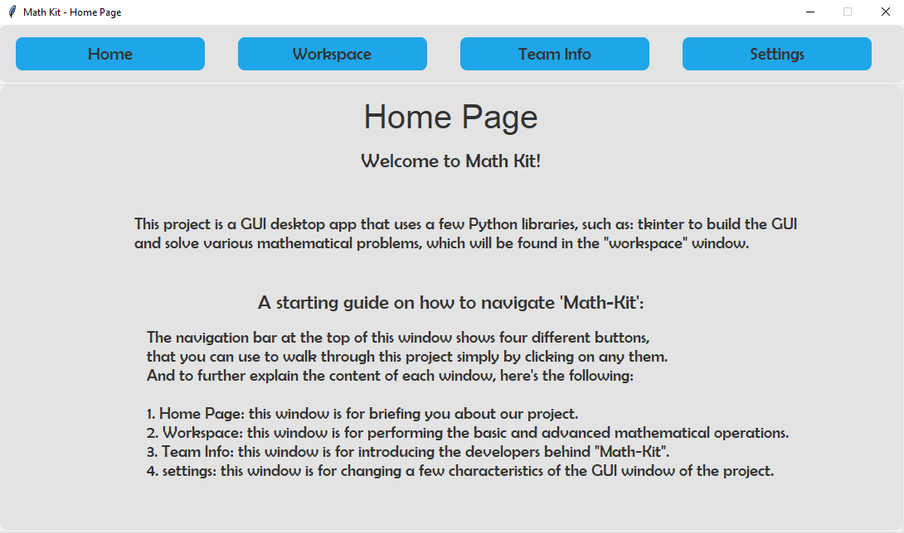

**The Workspace Window:**
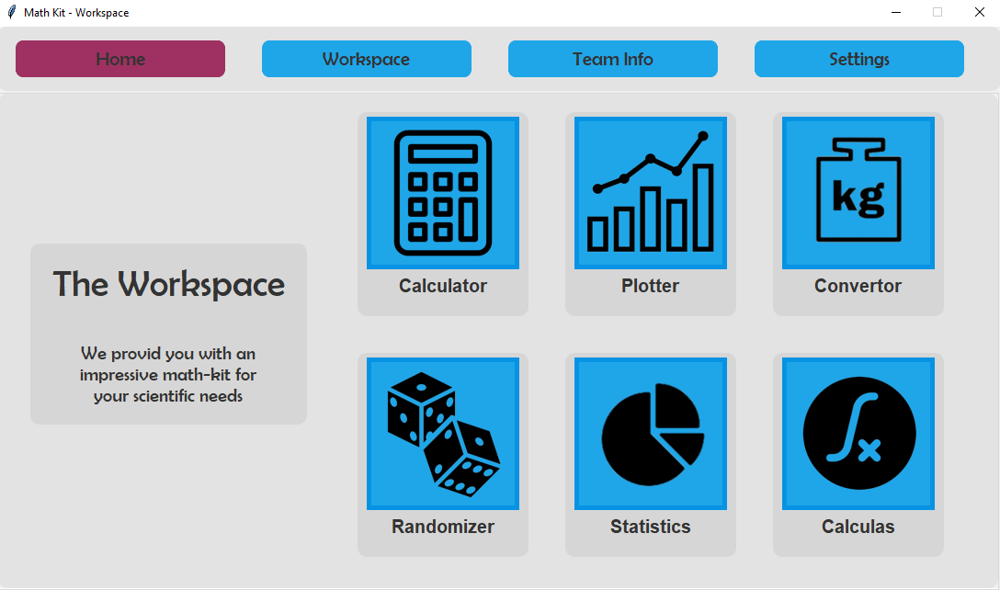

**The Calculator Window:**
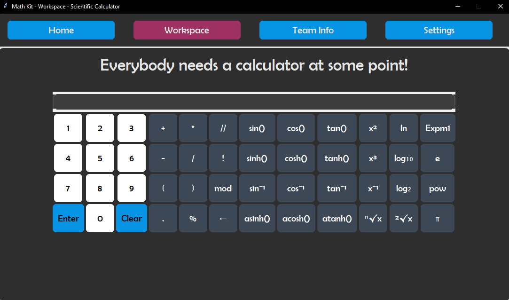

**The Plotter Window:**
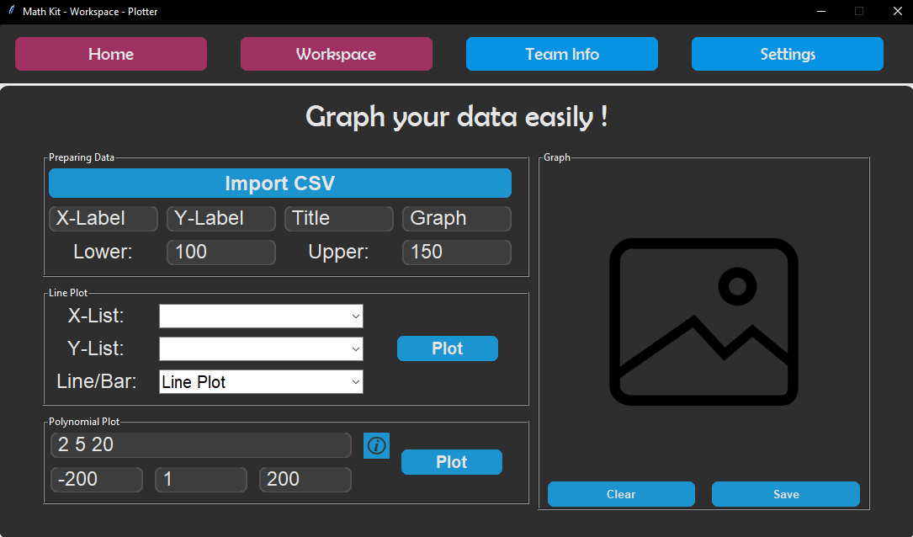

**The Convertor Window:**
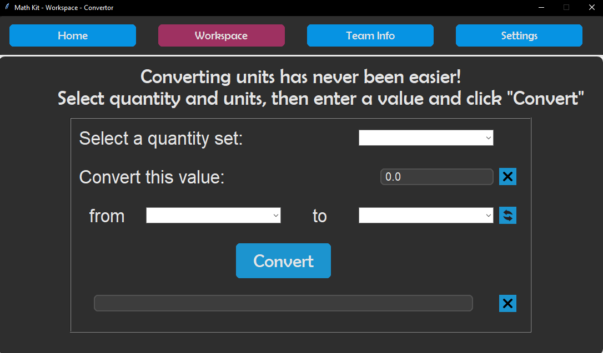

**The Randomizer Window:**
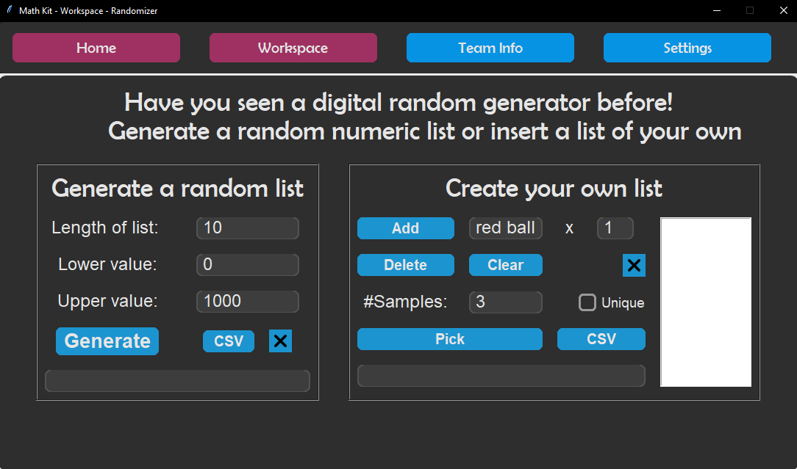

**The Statistics Window:**
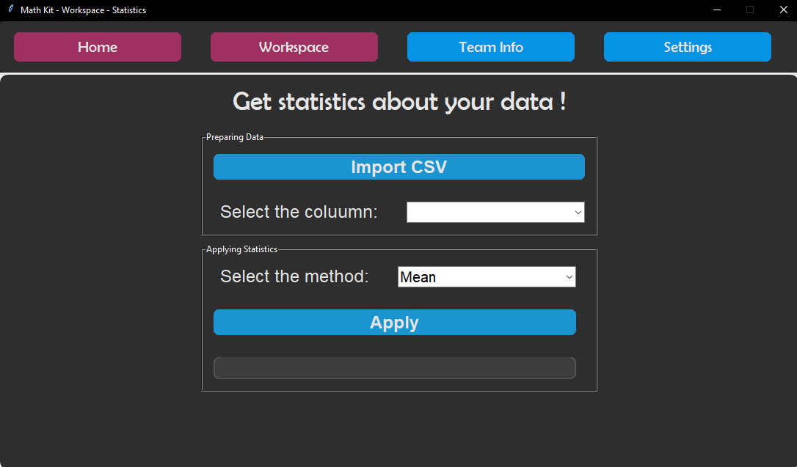

**The Calculas Window:**
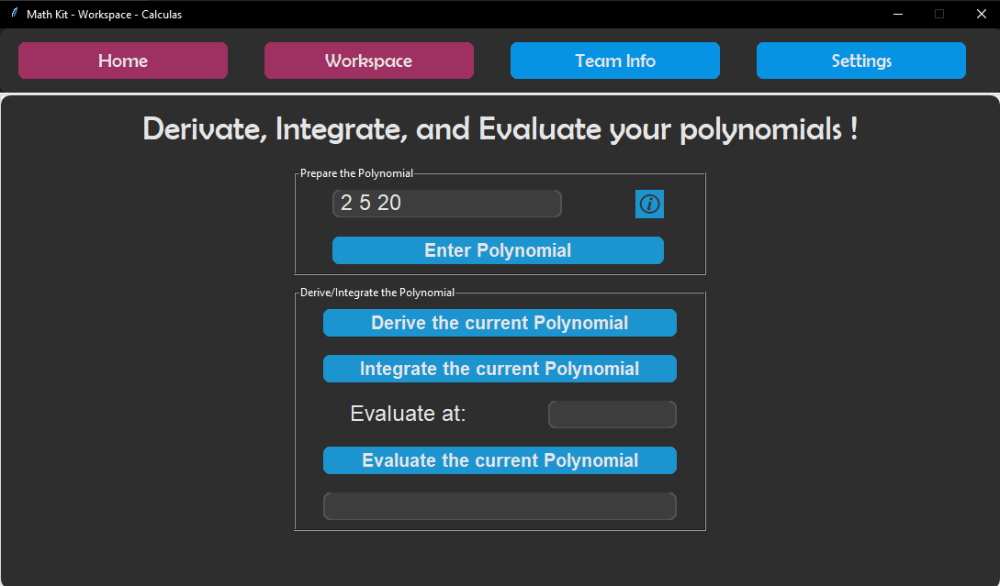

**The Team Info Window:**


**The Settings Window:**
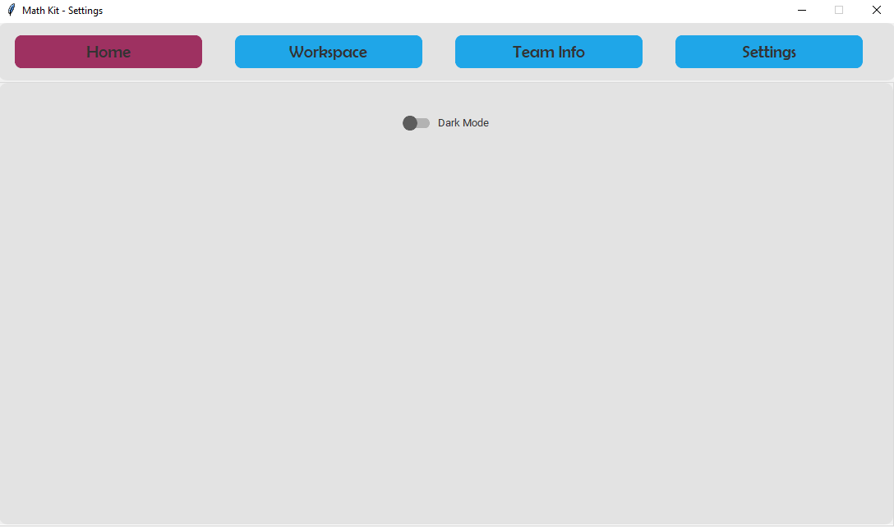

<br>

## **A Guide to Getting Started**
```
Clone this repository to your local machine, by following this command:

`$ git clone git@github.com:sarahhudaib/Math-Kit.git`

---------------------------------------------------------------

Navigate to the repo's directory and install required  dependencies:

`$ poetry install`
`$ pip install --upgrade pip`
`$ pip install customtkinter`
`$ pip install numpy`
`$ pip install matplotlib`
`$ pip install webbrowser`
`$ pip install playsound`
`$ pip install Pillow`
`$ -m pip install -U black` 


---------------------------------------------------------------

Open the repo in a text editor of your choice. In our case, we're assuming you're using VS Code:

`$ code .`

---------------------------------------------------------------

Activate the virtual environment:

`$ poetry shell`

---------------------------------------------------------------

Important notes:

1. For extra careful measures; when running the program make sure you have the latest updated version of python installed on your local machine (Python 3.10.1), specifically on Windows, you can use the following command:

`$ python -m pip install --upgrade pip`


2. Activate the virtual environment by running the following command:

`$ poetry shell`

definatly after installing poetry, using this command:

`$ poetry install`

3. Navigate inside "Math-Kit/math_kit" directory to run the program, preferably on "Windows Powershell" not "Ubuntu" and that's because WSL doesn't support rendering GUI, so it's advised to be careful as to not run into some issues you want to stay away from.

4. After cd'ing inside the above directory, and after activating the virtual environment, run this command 

`$ python main.py`

This will render a GUI window on your local machine, that has all the above mentioned features that you could navigate through very easily to perform any kind of mathematical operation.

---------------------------------------------------------------
```
<br>

<br>

## **Authors and Creators of Math-Kit Project**

- Sarah Hudaib
- Mustafa Alhasanat
- Batool Ragaya'h
- Salim Hassouneh


